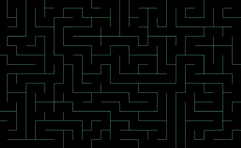

# MouseMaze
a small exercise in random maze generation and pathfinding in the C# [MonoGame](https://monogame.net/) framework

## Demo

## How It Works
Upon launch, the maze is generated using with an [iterative implementation](https://en.wikipedia.org/wiki/Maze_generation_algorithm#Iterative_implementation_(with_stack)) of the [randomized depth-first search](https://en.wikipedia.org/wiki/Depth-first_search) algorithm.
Mice can then be spawned in the maze with the right mouse button, and cheese can be spawned with the left mouse button.
If there is no cheese in the maze, the mice will wander around randomly with the [random mouse algorithm](https://en.wikipedia.org/wiki/Maze-solving_algorithm#Random_mouse_algorithm).
Otherwise, if there is cheese in the maze, mice will use a [recursive depth-first search](https://en.wikipedia.org/wiki/Maze_solving_algorithm#Recursive_algorithm) to determine a path to the cheese.

This project utilizes the [Primitive Buddy](https://www.nuget.org/packages/PrimitiveBuddy/) library for rendering primitives.
